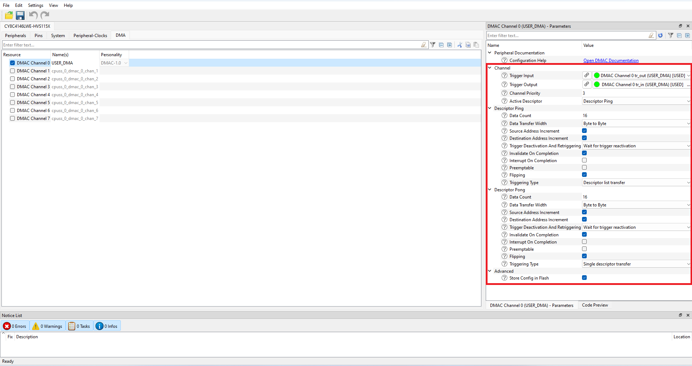

# PSoC&trade; 4: DMA Data Transfer with Descriptor Chain
**This code example shows how to transfer data from source memory to destination memory using the descriptor chain of the Direct Memory Access (DMA) to implement.**

## Device

The device used in this code example (CE) is:
- [PSoC™ 4 HVMS Series (High Voltage Mixed Signal)](https://www.infineon.com/cms/en/product/microcontroller/32-bit-psoc-arm-cortex-microcontroller/32-bit-psoc-4-hv-arm-cortex-m0/)

## Board
The board used for testing is:
- PSoC&trade; 4 HVMS Lite Kit ([KIT_PSoC4-HVMS-128K_LITE](https://www.infineon.com/cms/en/product/evaluation-boards/psoc4_hvms_lite_kit/))
- PSoC&trade; 4 HVMS Lite Kit ([KIT_PSoC4-HVMS-64K_LITE](https://www.infineon.com/cms/en/product/evaluation-boards/psoc4_hvms_lite_kit/))

## Scope of work
This example configures function to transfer data from source memory to destination memory using the descriptor chain transfer function of the Direct Memory Access (DMA) function. Transfer result shows window for terminal software.

## Introduction  
The DMA controller provides DataWire (DW) and direct memory access (DMA) functionality. The DMA controller has the following features:

- Supports up to four counter groups (device specific)
- Supports eight DMA channels
- Four levels of priority for each channel
- Byte (8 bits), half-word (16 bits), and word (32 bits) transfers 
- Three modes of operation supported for each channel
- Configurable interrupt generation
- Output trigger on completion of transfer
- Transfer sizes up to 65,536 data elements

The DMA controller supports three operation modes. These operational modes are different in how the DMA controller operates on a single trigger signal. These operating modes allow the user to implement different operation scenarios for the DMA. The operation modes are

- Mode 0: Single data element per trigger
- Mode 1: All data elements per trigger
- Mode 2: All data elements per trigger and automatically trigger chained descriptor

The data transfer specifics, such as source and destination address locations and the size of the transfer, are specified by a descriptor structure. Each channel has an independent descriptor structure.
The DMA controller provides active/sleep functionality and is not available in the DeepSleep power mode.

More details can be found in:
- PSoC&trade; 4 HVMS Series
  - [Architecture TRM](https://www.infineon.com/cms/en/product/microcontroller/32-bit-psoc-arm-cortex-microcontroller/32-bit-psoc-4-hv-arm-cortex-m0/)
  - [Registers TRM](https://www.infineon.com/cms/en/product/microcontroller/32-bit-psoc-arm-cortex-microcontroller/32-bit-psoc-4-hv-arm-cortex-m0/)
  - [Data Sheet](https://www.infineon.com/cms/en/product/microcontroller/32-bit-psoc-arm-cortex-microcontroller/32-bit-psoc-4-hv-arm-cortex-m0/)

## Hardware setup

This Code Example has been developed for:
- [KIT_PSoC4-HVMS-128K_LITE](https://www.infineon.com/cms/en/product/evaluation-boards/psoc4_hvms_lite_kit/) 
- [KIT_PSoC4-HVMS-64K_LITE](https://www.infineon.com/cms/en/product/evaluation-boards/psoc4_hvms_lite_kit/) 

**Figure 1. KIT_PSoC4-HVMS-128K_LITE (Top View)**
  

## Implementation

The firmware is implemented in *main.c* and performs the following functions:

1. Located transfer data (PING data: Source 1 / Destination 1, and PONG data
: Source 2 / Destination 2) in SRAM
2. Initialize and enable GPIO interrupt
3. Enable DMA Controller (DMAC) and initialize DMAC channel and descriptor configurations
4. Enable using DMAC channel
5. Set Trigger to initialize transfer
6. Confirm results on the display of terminal software

**ModusToolbox&trade; Device configurator**

This code example project can be created or imported using ModusToolbox&trade; IDE. To configure the project in the **Quick Panel**, click on **Device Configurator**    

**Figure 2. Select Device Configurator**
  

**Figure 3. Select DMAC Channel 0**
  

**Figure 4. Parameter Settings for DMAC Channel 0**
  

**Figure 5. SCB-UART Settings**
  

**Figure 6. System Clock Settings**
  

**Figure 7. Peripheral Clock Settings**
  

The basic idea is to display the results of a DMA transfer from source memory to destination memory in a Terminal window and visually compare the data on the source and destination sides.

- <a href="https://infineon.github.io/mtb-pdl-cat2/pdl_api_reference_manual/html/group__group__gpio__functions__init.html#gad61553f65d4e6bd827eb6464a7913461"><i>Cy_GPIO_Pin_Init()</i></a> reflects the DMA configuration to the device.
- Using DMA Controller hardware and channel are initialized by <a href="https://infineon.github.io/mtb-pdl-cat2/pdl_api_reference_manual/html/group__group__dmac__channel__functions.html#ga7b508e6cc332b4d009bf9b09ed6529b3"><i>Cy_DMAC_Channel_Init()</i></a>.
- Using DMA Controller descriptor is initialized by <a href="https://infineon.github.io/mtb-pdl-cat2/pdl_api_reference_manual/html/group__group__dmac__descriptor__functions.html#ga3043c7241e222dcb69c4a5db6f80e2c2"><i>Cy_DMAC_Descriptor_Init()</i></a>.
- The source address is configured by <a href="https://infineon.github.io/mtb-pdl-cat2/pdl_api_reference_manual/html/group__group__dmac__descriptor__functions.html#ga2c3b3f9e0ae139756b41a3f9b37c11d7"><i>Cy_DMAC_Descriptor_SetSrcAddress()</i></a>.
- The destination address is configured by <a href="https://infineon.github.io/mtb-pdl-cat2/pdl_api_reference_manual/html/group__group__dmac__descriptor__functions.html#gac02989cf3126dc0fa473a6ec5787cfa5"><i>Cy_DMAC_Descriptor_SetDstAddress()</i></a>.
- Using DMA Controller channel is enabled by <a href="https://infineon.github.io/mtb-pdl-cat2/pdl_api_reference_manual/html/group__group__dmac__channel__functions.html#gab39e11c3ad72ebfd07cdd9840385769b"><i>Cy_DMAC_Channel_Enable()</i></a>.
- Using DMA Controller is enabled by <a href="https://infineon.github.io/mtb-pdl-cat2/pdl_api_reference_manual/html/group__group__dmac__block__functions.html#ga3f45f389340c3282c59d6ffe6e5040b5"><i>Cy_DMAC_Enable()</i></a>.
- Transfer trigger is configured by <a href="https://infineon.github.io/mtb-pdl-cat2/pdl_api_reference_manual/html/group__group__trigmux__functions.html#gad3c1d26d25a47bc4beca499bf0407c80"><i>Cy_TrigMux_SwTrigger()</i></a>.
- Getting the transfer response code by <a href="https://infineon.github.io/mtb-pdl-cat2/pdl_api_reference_manual/html/group__group__dmac__descriptor__functions.html#ga0e960a7ad4a671523e5992594cc885cf"><i>Cy_DMAC_Descriptor_GetResponse()</i></a>.
- SCB UART Initialization is configured by <a href="https://infineon.github.io/mtb-pdl-cat2/pdl_api_reference_manual/html/group__group__scb__uart__general__functions.html#gacbc061f623d2fafbcfffcb58c5f2db51"><i>Cy_SCB_UART_Init()</i></a>.
- SCB UART Enable is configured by <a href="https://infineon.github.io/mtb-pdl-cat2/pdl_api_reference_manual/html/group__group__scb__uart__general__functions.html#ga503d0737dadf35620306ef3571d84905"><i>Cy_SCB_UART_Enable()</i></a>.
- SCB UART Put String data is configured by <a href="https://infineon.github.io/mtb-pdl-cat2/pdl_api_reference_manual/html/group__group__scb__uart__low__level__functions.html#ga4092c34575a47087e08a58529451914b"><i>Cy_SCB_UART_PutString()</i></a>.
- Using by <a href="https://infineon.github.io/mtb-pdl-cat2/pdl_api_reference_manual/html/group__group__scb__uart__low__level__functions.html#ga81aff78dcdc266d6cac81e714afef6c3"><i>Cy_SCB_UART_IsTxComplete()</i></a> execute empty check on the TX FIFO and shifter to see if there is any more data to send.
- SCB UART Put data elements are configured by <a href="https://infineon.github.io/mtb-pdl-cat2/pdl_api_reference_manual/html/group__group__scb__uart__low__level__functions.html#gae8eba8924ed4b8add6e7cabdf25a18fe"><i>Cy_SCB_UART_Put()</i></a>.

## Compiling and programming
Before testing this code example:  
- Power the board through the dedicated power connector 
- Connect the board to the PC through the USB interface
- Build the project using the dedicated Build button
 

**Figure 8. Build Project**
   or by right-clicking the project name and selecting "Build Project"
- To program the board, in the **Quick Panel**, scroll down, and click **[Project Name] Program (KitProg3_MiniProg4)**

## Run and Test

- Open the terminal program (example download and install [Tera term](https://teratermproject.github.io/index-en.html ) select the KitProg3 COM port. Set the serial port parameters to 8N1 and 115200 baud.

**Figure 9. Terminal startup**
   

In this example, the DMA Descriptor Data transfer was successful.

- After programming, the code example will start automatically and display the transfer result.

**Figure 10. Communication Results**
   

- You can debug the example to step through the code. In the IDE, use the **[Project Name] Debug (KitProg3_MiniProg4)** configuration in the **Quick Panel**. For details, see the "Program and debug" section in the [Eclipse IDE for Toolbox™ software user guide](https://www.cypress.com/MTBEclipseIDEUserGuide).

**Note:** **(Only while debugging)** On the CM7 CPU, some code in *main()* may execute before the debugger halts at the beginning of *main()*. This means that some code executes twice: once before the debugger stops execution, and again after the debugger resets the program counter to the beginning of *main()*. See [KBA231071](https://community.cypress.com/docs/DOC-21143) to learn about this and for the workaround.

## References  
Relevant Application notes are:
- AN0034 - Getting started with PSOC&trade; 4 HV MS MCUs in ModusToolbox&trade;

ModusToolbox&trade; is available online:
- <https://www.infineon.com/modustoolbox>

Associated PSoC&trade; 4 HVMS MCUs can be found on:
- <https://www.infineon.com/cms/en/product/microcontroller/32-bit-psoc-arm-cortex-microcontroller/32-bit-psoc-4-hv-arm-cortex-m0/>

More code examples can be found on the GIT repository:
- <https://github.com/Infineon/Code-Examples-for-ModusToolbox-Software>

For additional trainings, visit our webpage:  
- <https://www.infineon.com/cms/en/product/microcontroller/32-bit-psoc-arm-cortex-microcontroller/32-bit-psoc-4-hv-arm-cortex-m0/#!trainings>

For questions and support, use the PSoC&trade; 4 HVMS Forum:  
- <https://community.infineon.com/t5/PSoC-4/bd-p/psoc4>

